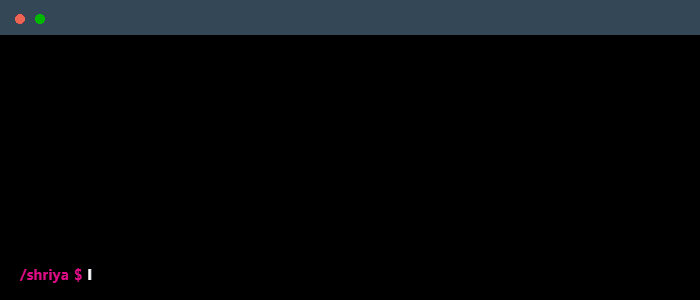

<!--
    Hey there, I'm Shriya Gupta!
    Happy to see you here exploring my README code
    Feel free to inspire!
    
    But may I please ask you to follow me in return? Just a click!
    You may also want to connect with me on LinkedIn :))
-->
 

    

## Main skills

  
  
  
  
  
  
  
  
  
  
  
  
  
  
  
  
  
  
  
  
  
  
  
  
  
  
  
  
  
  
  
  
  
  
  

## Learning

  
  
  
  
  
  
  
  
  
  
  

## What is Shriya upto?
Currently working on my major project which is inspired by [Regulatory Compliance Checker](https://github.com/Shriya-Guptaa/Regulatory-Compliance-Checker.git), but training and creating my own model and fine-tuning LLM using [Unsloth](https://github.com/unslothai/unsloth.git). ;)
## Connect with me!

  
  
  

<!--
     Oh, hello there, recruiters!
-->

### Employer?
> [!IMPORTANT]  
> <a href="https://raw.githubusercontent.com/Shriya-Guptaa/Shriya-Guptaa/main/assets/ShriyaGupta_resume.pdf" download> Download My Resume </a>

<!--
     Thanks for being my guest <3
-->
